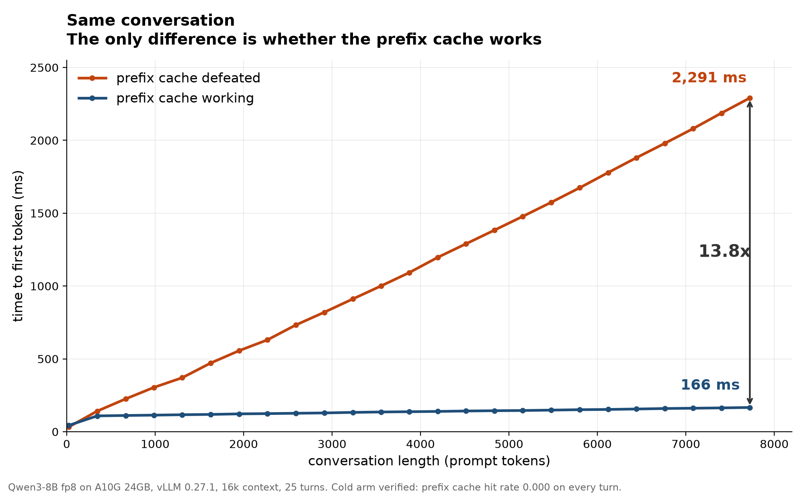

# LLM Inference Engine

**Serving Qwen3-8B on one 24 GB GPU, built from the ground up and measured at every layer.**

> **AI usage:** I built this with Claude Code (Opus for design, analysis and debugging; Sonnet,
> and later an Opus subagent, for mechanical implementation work), in this learning project.

This is a learning project in inference engineering: the layer between a trained model and the
person waiting for its answer. It starts with a deliberately naive server, writes a real engine
by hand, then studies vLLM, quantization, speculative decoding, caching, reasoning budgets and,
finally, a profiler's view of a single generated token. On top of it all sits a chat app with live
web search, served from the same card.

The rule throughout: **predict, measure, explain the gap.** Every number was predicted in writing,
with its arithmetic, before the run that measured it. About a third of the predictions were wrong,
and those turned out to be the most useful entries in the project.

| | |
|---|---|
| **17.2x** the naive server's capacity | 0.33 to 5.70 requests/s, one benchmark, one GPU |
| **75x** lower tail latency | p95 time to first token 25.1 s to 336 ms with an engine written from scratch |
| **35x** faster first word, turn 30 of a chat | prefix caching, after fixing a 4-token chat-template bug |
| **51 people** answered at once | each at 16 tokens/s, memory under half full, nobody queued |
| **35% to 79%** on FreshQA | live web search plus reasoning, through the real app |

## The core lesson

**No optimization has a speed-up. It has a range, and the workload picks the number.** The same
quantization flag was worth 1.07x on short requests and 2.35x on long ones. The same speculative
decoder was worth 1.19x on long documents and 2.25x on arithmetic. The same prefix cache was worth
nothing on unique prompts and 35x in a conversation. In every case the question that decided it was
the same: was anything actually pressing against the limit this technique relieves? Most of this
repo is that question, asked with a matched pair and a control.

## The journey, phase by phase

Each phase ends with something runnable and a measurement. The full write-up of every phase is in
**[docs/REPORT.md](docs/REPORT.md)**.

| # | Phase | What it found | Details |
|---|---|---|---|
| 0 | **Build the ruler first.** A roofline model, an open-loop load generator, a fake server to test them on | Predicted weights in memory to 0.0%, single-request speed to 4%, server capacity to 2%, from bandwidth and parameter count alone | [report](docs/REPORT.md#phase-1-3) |
| 1 | **A deliberately naive server** (HuggingFace `.generate()` behind a lock) | Per-token speed stayed flat at 44 ms while time to first token went 354 ms to 7.3 s: the fingerprint of a queue, not a slow model | [report](docs/REPORT.md#phase-1-3) |
| 2 | **An engine from scratch**: manual KV cache, static then continuous batching, a scheduler that admits and evicts mid-flight | 4.8x capacity (0.33 to 1.60 req/s). A paged allocator was designed, costed and deliberately not built: the tax it targeted lived in the attention kernel, where an allocator cannot reach | [report](docs/REPORT.md#phase-1-3) |
| 3 | **vLLM as an object of study**, every flag ablated | 17.2x the baseline. Prefix caching was worth 0% on unique prompts, chunked prefill bought tail latency not throughput, and 3.5x came from kernels, not any named feature | [report](docs/REPORT.md#phase-1-3) |
| 4 | **Quantization**, measured for speed, capacity and answer quality | fp8 doubled capacity on long requests within the accuracy noise floor. int4 broke 37% of 32-step arithmetic answering directly, and 1% when allowed to reason first | [report](docs/REPORT.md#phase-4) |
| 5 | **Speculative decoding** (EAGLE3, n-gram, a small draft model) | 1.19x to 2.25x depending on content, no change in answers. The standard benchmark understated it by 40%, and the result holds at the temperature the app serves (1.85x at T 0.6) | [report](docs/REPORT.md#phase-5) |
| 6 | **The chat app's foundations**: gateway, web search, context management, caching | Speculation's collapse under load was KV-cache starvation, not verification overhead. A 4-token template bug was costing 2.3x on every chat turn. fp8 KV cut time to first token 23x on long prompts | [report](docs/REPORT.md#phase-6-crossover) |
| 7 | **Thinking budgets as a scheduling policy** | A middling budget is the worst one: 1,024 tokens scored 83.1% against 94.4% at 128, and took 24 s longer, because it cuts the reasoning off before the answer | [report](docs/REPORT.md#phase-7-budget) |
| 6b-d | **The app as an agent, end to end and under load** | A LangGraph planner decides search and thinking per message (93% agreement on 581 labelled questions). One A10G held 51 concurrent conversations' answers at 16 tok/s | [report](docs/REPORT.md#phase-6b) |
| 8 | **Inside one decode step** with Nsight Systems and the PyTorch profiler | The 6 ms gap to vLLM is not the math (identical cuBLAS kernels) but 2,079 unfused launches and the GPU idling between them. Replaying the step as a CUDA graph closed 3.5 ms of it | [report](docs/REPORT.md#phase-8) |
| 9 | **Checking the book's checks**: perplexity as a quality test, and the cost of forcing JSON | Perplexity moved 0.2% on the exact arithmetic where int4 breaks 37% of answers: it never lets an error feed the next token. The planner's JSON schema costs 0.05% per token | [report](docs/REPORT.md#phase-9) |
| 10 | **L4 vs A10G**: half the bandwidth, native fp8, the A10G's exact traffic replayed | 1.75x slower for one user in every format, and native fp8 is no help there. Under load it is the difference between collapsing (25 s waits) and matching the A10G for 19% less per hour | [report](docs/REPORT.md#phase-10) |

## A few results worth a picture

**Caching decides how fast a conversation feels.** The same 25-turn conversation, with the prefix
cache working and with it deliberately defeated:



That was 13.8x by turn 25; fixing a 4-token mismatch in Qwen3's own chat template later took it to
35x by turn 30. The template wrote an empty thinking block into the prompt and dropped it from
history, so the model re-read its own last answer every turn. ([details](docs/REPORT.md#phase-6-app-battery))

**One 24 GB GPU is a lot of capacity.** Real 4-turn conversations arriving at random, with readers
pausing between turns:


Memory never filled and no request ever queued. What degrades first is a ~50-token plan the app
writes before every answer, which nobody sees but everyone waits for. ([details](docs/REPORT.md#phase-6d))

**Where the time in one token goes** (Qwen3-8B bf16, batch 1, A10G):

| | per token | GPU launches | the matrix multiplies | everything else | GPU idle |
|---|---|---|---|---|---|
| this repo's engine | 40.7 ms | 2,079 | 32.3 ms | 5.9 ms | 2.5 ms |
| the same engine as a CUDA graph | 37.2 ms | 1 graph (653 kernels) | 32.3 ms | 4.0 ms | 0.9 ms |
| vLLM | 34.6 ms | 1 graph (450 kernels) | ~33 ms | ~1.5 ms | ~0.1 ms |

Reading 16 GB of weights costs every engine the same. A good engine wins on everything around it.
([details](docs/REPORT.md#phase-8))

## The chat app

A Perplexity-style assistant served from the same GPU: a LangGraph agent plans each message
(search or not, which queries, think or not) with a schema-constrained call, searches the web in
parallel, and streams a cited answer. Web search takes FreshQA accuracy from 35% to 65%, reasoning
to 79%, with the first word on screen in about 2 s. The cache is warmed after every answer so the
next turn starts hot, and long chats are summarised in the background. The frontend is React and
TypeScript, with a separate lab bench UI for watching the engine live.
([details](docs/REPORT.md#phase-6c))

## What this project demonstrates

- **Performance modelling.** Memory, speed and capacity predicted from first principles before
  measuring, and the misses explained rather than refitted.
- **Systems engineering.** A KV cache, continuous batching with admission control, an
  OpenAI-compatible streaming server, an inference gateway and a full-stack chat app.
- **Measurement design.** Open-loop Poisson load, p50/p95/p99 rather than means, paired
  significance tests against a measured noise floor, controls that read the engine's own counters
  to prove they are controlling, and instruments tested before they are trusted.
- **Profiling.** Nsight Systems and the PyTorch profiler on a hand-written engine and on vLLM, with
  the gap attributed kernel by kernel.
- **Engineering judgement.** Knowing what not to build, and which result to stop believing when a
  control says otherwise.

The prediction log, with every forecast, its arithmetic and the result next to it, is
[`NOTES/predictions.md`](NOTES/predictions.md). The wrong ones are the best reading.

## What is here

```
tools/roofline.py     predicts memory budget, KV capacity, decode roofline,
                      batch scaling, and prefill/TTFT from hardware specs alone
tools/bench.py        open-loop Poisson load generator; per-request TTFT/ITL/E2E;
                      --replay re-sends a past run's exact arrivals and prompts
tools/l4report.py     L4 vs A10G from raw records, one set of definitions for both cards
tools/curve.py        collapses a sweep into latency-vs-throughput curve points
tools/kvprobe.py      measures the KV cache off the GPU directly
tools/mkitems.py      generates the quality-eval item set; --selftest re-derives
                      every answer by parsing the problem text it emitted
tools/qualeval.py     paired quality harness: run, offline regrade, exact McNemar
tools/specmon.py      reads speculative-decoding acceptance off vLLM's metrics;
                      reports acceptance BY DRAFT POSITION, not just the scalar
tools/convo.py        stateful multi-turn conversation driver; measures prefix-cache
                      behaviour, which an open-loop load generator cannot see
tools/appdrive.py     drives the chat app's own API; joins each turn to the gateway trace;
                      load mode: Poisson arrivals of multi-turn conversations
tools/planeval.py     scores the planner against labelled questions
tools/plansets.py     builds the planner sets from MTRAG, QReCC, FreshQA and GSM8K
tools/freshjudge.py   grades FreshQA answers with a separate Qwen3-8B judge
tools/p9eval.py       perplexity from vLLM's prompt logprobs; JSON-schema cost pairs
tools/mock_server.py  dependency-free fake vLLM with real capacity, so the
                      benchmark harness can be validated without a GPU
baseline/server.py    Phase 1: HuggingFace .generate() behind a global lock
engine/               Phase 2: manual KV cache, static then continuous batching,
                      scheduler with admission control, OpenAI-streaming server;
                      Phase 8: profile_step.py and graph_step.py (CUDA graph)
labbench/             the instrument surface: byte-faithful streaming proxy,
                      backend switcher, live Prometheus and journal probes
gateway/              the inference gateway: prompt assembly, web search,
                      context overflow strategy, thinking budget, request tracing
app/                  the chat API and its LangGraph agent: planner, parallel search,
                      cited answer, background summary, cache warm-up; SQLite
                      branching message tree, SSE streaming
app/web/, labbench/web/  Vite + React + TypeScript frontends
infra/                provisioning, cost guardrails, one-command sessions,
                      pinned-KV vLLM launcher, every experiment's run script
docs/REPORT.md        the full write-up, phase by phase
NOTES/predictions.md  the prediction log
```

## Quick start

```bash
uv sync

# What should an 8B model do on an A10G? No GPU required.
uv run tools/roofline.py --model qwen3-8b --gpu a10g
uv run tools/roofline.py --model qwen3-8b --gpu a10g --dtype awq4 --context 8192

# Validate the benchmark harness against a fake server, also no GPU required.
uv run tools/mock_server.py --port 8000 --batch 8 --itl-ms 25 &
uv run tools/bench.py --url http://localhost:8000 --sweep 2,4,8,12,16 --duration 20
```

`bench.py` fires requests at a fixed **rate**, never waiting for responses. Closed-loop
generators throttle offered load by the very latency they are measuring, so a queue can
never form and the reported p95 is fiction.

## Provisioning

```bash
./infra/launch.sh     # g5.2xlarge, quota pre-flight, SSM-resolved AMI, IP-locked SG
./infra/up.sh         # start a stopped box, re-authorize your current IP
./infra/down.sh       # stop it (never terminate -- the root volume holds the model)
```

A forgotten GPU box is roughly $200/week, so `infra/idle-shutdown.sh` stops the instance after
30 minutes of genuine idleness. Idleness is judged by **request activity**, not GPU memory: an
inference server holds its KV cache at 0% utilization forever, so "a process holds GPU memory"
would disable the guardrail entirely.

## Hardware

Single NVIDIA A10G. Sold as 24 GB; `nvidia-smi` reports 22.49 GiB; CUDA can actually address
**22.06 GiB** (the difference is driver/ECC reserve). ~600 GB/s memory bandwidth. Every number in
this repo is specific to that card except Phase 10's, which ran on an L4, and `tools/roofline.py`
will recompute them for others.
