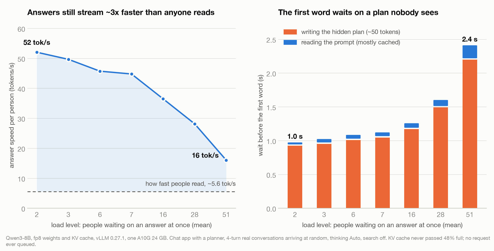

# Report: every phase, every number

The full write-up behind the [README](../README.md). Each section is one phase of the project: what
was built, what was predicted, what was measured, and why the two differed. The raw lab notebook,
with every prediction's arithmetic written down before its run, is
[`NOTES/predictions.md`](../NOTES/predictions.md); the data behind every table is in
[`results/`](../results/).

All numbers are Qwen3-8B on one NVIDIA A10G (24 GB, ~600 GB/s) unless a table says otherwise, and
every table states its configuration.

## Contents

1. [Phases 1-3: a naive server, an engine from scratch, and vLLM](#phase-1-3)
2. [Phase 4: quantization is worth 2x more on one workload than another](#phase-4)
3. [Phase 5: speculative decoding is worth 1.19x or 2.25x, and the benchmark hid it](#phase-5)
4. [Phase 6: the crossover was never a property of speculation](#phase-6-crossover)
5. [Phase 6: the app battery, and what a user actually waits for](#phase-6-app-battery)
6. [Phase 7: more thinking is not better, and the middle is the worst place to be](#phase-7-budget)
7. [Phase 7: overlapping the search with generation](#phase-7-overlap)
8. [Phase 6b: the app end to end](#phase-6b)
9. [Phase 6c: the app as an agent](#phase-6c)
10. [Phase 6d: one 24 GB GPU under load](#phase-6d)
11. [Phase 8: inside one decode step](#phase-8)

<a id="phase-1-3"></a>

## Phases 1-3: a naive server, an engine from scratch, and vLLM

**Phase 1** built a deliberately naive server and explained it rather than fixing it.
Inter-token latency stayed **flat at 44 ms across a 5x range of offered load** while
time-to-first-token went from 354 ms to 7,293 ms. That is the fingerprint of a serialized
server: per-token speed cannot degrade when only one request is ever on the GPU, so all
contention becomes queue wait. Batch-1 decode was already within 4% of the
memory-bandwidth roofline, which said the remaining problem was capacity, not speed.

**Phase 2** wrote the engine that fixes it: manual KV cache, static batching, then a
continuous-batching scheduler that admits and evicts requests mid-flight. Decode-slot
utilisation went from 30.1% to 82.6% on ragged workloads.

**Phase 3** swapped in vLLM and then ablated every flag to attribute the 3.6x gap.
Prefix caching was worth **0%** on unique traffic (2.9x on shared prompts, which is what
a careless benchmark measures); chunked prefill 2% of capacity but **34% better p95
ITL**; fp8 KV cache +11%. **3.5x remained attributable to kernels and core scheduling
rather than to any single flag** — which is the honest answer, and the one a flag-tuning
writeup never reaches.

<a id="phase-4"></a>

## Phase 4: quantization is worth 2x more on one workload than another

The same technique, the same GPU, the same model, the same client. Only the request
shape changed:

| | 512 in / 64 out | 4096 in / 1024 out |
|---|---|---|
| fp8 weights | 1.07x | **2.04x** |
| int4 w4a16 | 1.16x | **2.35x** |

On small requests the KV cache sits ~29% full, so freeing memory buys nothing and only
the bandwidth term survives. On requests shaped like a real web-search turn the cache is
the binding constraint and the same flag is transformative. **Benchmarking quantization
on the workload you already had set up is how you get this wrong by a factor of two.**

Quality was measured against a noise floor, because a model does not agree with itself:
batch composition shifts bf16 accumulation order, so bf16 was run twice to establish
`d0` = 1.8% before any quantized number was believed. int4 costs 2.1 accuracy points
overall -- and that aggregate hides everything:

| what int4 breaks, of what bf16 got right | |
|---|---|
| 4-step arithmetic | 0% |
| 8-step | 3% |
| 16-step | 9% |
| **32-step** | **37%** |
| long-context retrieval, any depth | **0%** |

The damage is specific to multi-step reasoning and does not touch retrieval.

**And thinking protects against it.** On identical 32-step problems int4 breaks 1% of
what bf16 solved when allowed to reason first, and 37% when not. The project's own spec
predicted the opposite -- that long reasoning chains would compound small errors -- and
the correction is annotated in place rather than deleted.

<a id="phase-5"></a>

## Phase 5: the same technique is worth 1.19x or 2.25x, and the benchmark hid it

Speculative decoding has a small helper model guess the next few tokens; the big model
checks them all in one pass and keeps the ones it agrees with. It works because decode is
memory-bound: producing one token reads all 16.39 GB of weights, and during that read
**the compute units sit 99.6% idle**. Guessing spends the idle half.

The measured speed-up is not one number. It is a range set entirely by request shape:

| workload | speed-up |
|---|---|
| arithmetic, no thinking block | **2.25x** |
| arithmetic with thinking | **2.05x** |
| natural-language reasoning (GSM8K) | **1.85x** |
| the synthetic benchmark prompt | 1.45x |
| long document in, short answer out | **1.19x** |

**The benchmark understated the technique by 40%.** Every acceptance figure was first
measured on `bench.py`'s synthetic filler, which is generated tokens rather than language
and is the least guessable input there is. Real work is roughly twice as guessable. The
last row is the opposite failure: that request is almost entirely prompt-reading, and
speculation only accelerates writing, so a genuinely good guess rate is diluted to nothing.
A retrieval-heavy product -- which is what Phase 6 builds -- would gain almost nothing from
it end to end while still paying the full memory bill.

**Thinking text is harder to guess than ordinary text**, 0.596 against 0.671 acceptance on
identical problems. The prediction written beforehand said the opposite, reasoning that
chain-of-thought is repetitive scaffolding. It is the reverse: thinking is where the model
explores and backtracks. That matters because ~1,000 thinking tokens is ~36 seconds of
blank screen, and it is the hardest part of the response to accelerate.

**The helper costs 1.78x its own weight**, and the excess was not weights at all. Predicted
from its config file to within 2% (1.904 GiB), it removed 24,720 tokens of KV cache rather
than the predicted 13,863: checking four positions at once needs ~4x the working memory, and
the GPU pre-compiles routines for the new shapes. Consequence: at full precision the helper
eats over half the cache and leaves **1.9 concurrent requests -- unusable**, while on fp8 it
costs 24% and leaves 8.5. **Quantization is what makes speculative decoding affordable**,
which is Phase 4's result arriving from the opposite direction.

**And it stops working under load.** Sweeping arrival rate on the small workload,
speculation is 1.88x ahead at 2 req/s and **2.8x behind at 6** -- the sign flips between 4
and 6. On the long-context workload it never flips. Two workloads, opposite answers about
whether to enable the feature. Phase 6 measured *why*, and the cause named here is not
the right one.

Three ways to guess were compared, and the best guesser is not the fastest configuration:

| guesser | KV cost | tokens/step | speed-up |
|---|---|---|---|
| text repetition (no model) | **2,304** (3%) | 1.18 | 1.07x |
| EAGLE3 head | 16,368 (24%) | 2.47 | **1.85x** |
| Qwen3-0.6B | **36,448** (53%) | **3.17** | 1.75x |

The small model guesses 28% better and finishes 5% slower, because running 28 layers three
times per step costs more than running one layer three times -- and the *lighter* model
carries the *heavier* cache, since 28 layers of its own history dwarf the head's single one.

**And the setting nobody had tested was one too high.** Every measurement in this phase
used k=3 -- three tokens guessed per step -- because that is what the helper's checkpoint
ships with. Sweeping it:

| tokens guessed ahead | speed-up | tokens per step |
|---|---|---|
| 1 | 1.355x | 1.54 |
| **2** | **1.488x** | 1.83 |
| 3 (the default) | 1.450x | 1.91 |
| 5 | 1.338x | 2.00 |
| 7 | 1.215x | 2.03 |

Guessing further ahead keeps working -- k=7 really does emit 32% more tokens per step than
k=2. It just costs more than it returns, because acceptance decays geometrically with
position while the drafting cost grows linearly. **k=2 is 2.6% faster than the shipped
default and k=7 is 18% worse**, so every number above is a slight understatement.

The cost model predicted this shape from first principles and matched the measured
efficiency to within 4% at every k -- the most accurate prediction of the phase, and the
one built from measured quantities rather than expectations. The memory prediction attached
to it was flatly wrong: KV cache came back byte-identical at every k, because run-to-run
variance in vLLM's startup profile (14%) is far larger than the effect being resolved (~1%).

Quality was verified rather than assumed: 1,210 paired items, **89.3% -> 89.9% accuracy**,
answers differing on 2.8% against a 1.8% floor measured by running the model against itself.
Three whole categories reproduced identical answers on every item; all disagreement landed
in the one slice where the model scores 44% and is barely above guessing. That is the
signature of ordinary nondeterminism, not of a technique changing the answer.

**Every number above was measured at temperature 0, and they hold at the temperature the app
serves.** Greedy decoding is the friendliest case for speculation, and the Qwen3 card forbids it,
so the headline was re-run with the identical recipe at T = 0, 0.3, 0.6 and 1.0. The T = 0 control
reproduced Phase 5 to the verify step.

| slice | T = 0 | T = 0.3 | T = 0.6 (Qwen3 thinking) | T = 1.0 |
|---|---|---|---|---|
| natural reasoning (GSM8K) | 1.85x | 1.84x | **1.85x** | 1.81x |
| arithmetic with thinking | 2.05x | 1.99x | **1.98x** | 1.88x |

*Qwen3-8B fp8, EAGLE3 k=3, A10G, concurrency 1, 12 items per cell; T > 0 with top_p 0.95, top_k 20.*

The prediction, built from the EAGLE paper's 12-23% loss between T = 0 and 1, was 5x too
pessimistic. That loss was measured on untruncated chat. Here top_k and top_p cut the tail before
sampling, so on most reasoning steps the model's top token still carries nearly all the probability
and the greedily drafted guess survives almost as often as under greedy decoding.

<a id="phase-6-crossover"></a>

## Phase 6: the crossover was never a property of speculation

Phase 5 watched speculation go 1.88x ahead at 2 req/s and 2.8x behind at 6, and read the
flip as verification overhead ceasing to hide at high batch. That is the textbook
explanation. It is not what is happening here.

Run as a matrix instead, quantization against speculation, identical real prompts in an
identical order, and the flip happens for one configuration and not the other:

| weights | spec | KV budget | batch-1 | cap @2 req/s | cap @6 req/s |
|---|---|---|---|---|---|
| bf16 | off | 33,312 | 29.5 tok/s | 1.72 req/s | 3.58 req/s |
| bf16 | on | **would not start** | -- | -- | -- |
| fp8 | off | 74,880 | 53.4 | 1.65 | 4.52 |
| fp8 | on | 51,232 | **97.9** | 2.37 | 3.56 |
| int4 | off | 101,920 | 84.6 | 1.65 | 4.73 |
| int4 | on | 77,280 | **143.1** | 1.96 | **5.30** |

*Qwen3-8B, vLLM 0.27.1, fp16 KV, 16k context, EAGLE3 k=2, 650 real arithmetic prompts.*

Speculation charges both configurations almost exactly the same KV: 23,648 tokens and
24,640. What differs is what is left afterwards. The engine had been logging the answer
every ten seconds the whole time -- **fp8+spec ran at 95.7% KV occupancy with 26 requests
queued, int4+spec at 18.6% with none**, at near-identical batch sizes of 90 and 88. Same
draft head, same batch, opposite outcome. That is queueing, not overhead.

Confirmed by intervention rather than left as a reading: halving KV bytes per token with
`--kv-cache-dtype fp8` and changing nothing else took fp8+spec from **86.1% occupancy and
26 queued to 12.0% and zero**, and its capacity at 6 req/s from 0.97x of control to
**1.20x**. The crossover disappears. **Quantization does not merely make speculation
affordable, it decides whether the crossover exists in the range you care about.**

**But fp8 KV is not a free win, and the control is what says so.** With speculation off,
where 74,880 tokens were already sufficient, it made capacity 14% *worse* (5.12 -> 4.42
req/s) while holding 135,152 tokens. It helps exactly where KV is the binding constraint
and hurts where it is not -- the same lesson as Phase 3's prefix caching and Phase 4's
quantization, arriving for the third time.

An accident said it louder than the designed comparison. The same command profiled 51,232
KV tokens on one day and 58,816 on another, pure startup variance, and capacity at 6 req/s
tracked it monotonically: 3.56, then 4.97, then 5.29 req/s at 102,464 tokens. **A 14.8%
difference in KV budget from noise alone moved capacity 40%** -- which is why every KV
allocation in this project is now pinned rather than profiled.

**Prefix caching is worth 13.8x, and the control had to prove itself first.** One
conversation grown to 25 turns against the same conversation with a fresh random prefix at
position zero each turn:

| turn | context | warm TTFT | cold TTFT | ratio |
|---|---|---|---|---|
| 1 | 62 | 28.4 ms | 32.4 ms | 1.1x |
| 10 | 2,947 | 128.5 ms | 820.2 ms | 6.4x |
| **25** | **7,761** | **165.7 ms** | **2,290.8 ms** | **13.8x** |

*fp8 weights, fp16 KV, 16k context, no speculation, 300 output tokens per turn.*

A cached token costs **29x** less than an uncached one (0.0100 against 0.2912 ms per prompt
token) but it does not cost nothing: caching removes recomputation, and each turn's new
tokens must still attend over the whole cached history. That residual is the warm slope.

The first two attempts at this measurement produced a null result that read as a finding.
The cold arm prefixed its noise to the new user message, where the conversation history
still renders first, so the cache hit exactly as in the warm arm and the two curves landed
1.0x apart against a predicted 21x. **The control now verifies itself and aborts**: it reads
the engine's own prefix-cache hit rate at turn 3 and refuses to collect data unless it is
near zero. It measured 0.000 at all 25 turns.

That still left the warm arm proving nothing -- it recorded no cache figures, so "the cache
was working" was an inference from its flat slope. Both arms were rerun on one server with
both reporting: **warm goes 0.000 to 0.957, cold holds 0.000, and the separation reproduced
at 13.76x against 13.83x.** The cold curve hit the same 2,290.8 ms at turn 25 both times.

**The rerun then showed what the first run could not.** Tokens recognised at turn N equal
turn N-1's *prompt*, floored to vLLM's 16-token block, on 24 of 24 turns -- so **the model's
own reply is never cached and is re-prefilled every turn**, ~300 tokens of work already done.
**That turned out to be a known upstream bug**, [Qwen3 issue 1826](https://github.com/QwenLM/Qwen3/issues/1826).
With thinking disabled, Qwen3's chat template writes an empty `<think></think>` block into
the prompt it asks the model to continue, but strips it when re-rendering that same turn as
history. Four tokens. So turn N's prompt is not a prefix of turn N-1's, the match stops
there, and the reply plus everything after it is recomputed.

The fix is the one the issue proposes -- apply the block to history too -- and it is applied
at the server with `--chat-template`. Rendering the prompts locally showed the stock template
breaking at **5 of 5** turn transitions and the patched one at **0 of 5**. On the box it is
worth **2.3x**: warm TTFT at turn 30 goes 188 ms to 81.7 ms, and the hit rate reaches 1.00.

Worth noting how long that took to find by measurement alone. The bug was already written up
with its fix; a web search would have replaced an afternoon. The rule since: **measure what
is specific to this setup, look up what belongs to a library.**

Two results fell out of data already collected. Dividing measured ITL into weight bytes per
token gives achieved bandwidth, and **it falls as quantization deepens** -- 79.8% of the
A10G's 600 GB/s at bf16, 72.2% at fp8, 57.4% at int4. That is the Marlin dequantization
penalty made visible on a card with no native fp8, and it is why fp8 is worth 1.81x rather
than the 2.0x that halving the weight bytes implies. Prefill shows the same tax
independently, at 14%.

And the noise floor moved. Phase 4 measured `d0` = 1.8% and Phase 5 tested against it
legitimately, on the same item mix. Re-running an identical configuration against itself on
a **harder** mix gives **7.8%**, concentrated exactly where the model is near its competence
limit (25.7% churn on the slice it half-solves, 0.0% where it scores 100% and 0.0% where it
scores 0%). **A noise floor is a property of the item mix, not of the model**, and carrying
one between experiments is invalid. That correction retired a claim this project had already
made.

The measurement surface itself is `labbench/`: a byte-faithful OpenAI-streaming proxy, a
radio-button backend switcher, live probes over vLLM's Prometheus endpoint and journal, and
a React UI that renders every stage of a request. Building it produced its own instrument
bug, in the family this project keeps meeting -- the metric binder summed Prometheus
`_created` series, which are unix timestamps of counter creation, into counter roles and
reported a **prefix cache hit rate of 0.9999998** computed from two clocks.

<a id="phase-6-app-battery"></a>

## Phase 6: the app battery, and what a user actually waits for

Nine measurements against a chat app with web search, on one GPU, all at one code version
with the KV budget pinned. The engine phases measured the engine; this measures the product.

**Where the wait goes.** Search 626 ms, fetching pages 741 ms, extracting text 39 ms --
**1.4 seconds before the GPU is touched**. Inference is then 81% of a 300-token turn but
only 46% of the time to the first word. Both are true, and which one is the headline depends
entirely on how long the answer is. That is this project's recurring lesson turned on its
own phase.

**A conversation is the workload prefix caching was built for.**

| turn | cache working | cache defeated | ratio |
|---|---|---|---|
| 10 | 51.7 ms | 830.8 ms | 16.1x |
| **30** | **81.7 ms** | **2,895.7 ms** | **35.4x** |

*fp8 weights, fp16 KV, 16,384 context, KV pinned to 69,264 tokens, template patched.*

**Reopening a cold chat costs 5.1 seconds**, because nothing is cached and the whole history
is recomputed. It is the worst latency the app can produce and no ordinary benchmark sees it,
having no yesterday. The residual also says prefill is **not linear**: predicted 4,436 ms
from a slope fitted over short prompts, measured 5,098. Attention is quadratic in sequence
length while the weight read is linear, so every cold-open estimate in this phase is a lower
bound rather than an estimate.

**Compressing the KV cache is the biggest single configuration win for this workload.** From
identical pinned memory, fp8 KV holds 138,528 tokens against 74,880, and on long retrieved
prompts cuts time-to-first-token from **1,462 ms to 64 ms at 1 req/s -- 23x**. Long prompts
are exactly where cache space is the binding constraint. Speculative decoding, by contrast,
generates **1.49x faster per token** and makes the first token *slower*, because the draft
model takes cache the prompts need.

**Two measurements came back as bugs rather than findings, which is the better outcome.**

Thinking kept in history versus stripped performed **identically** (74.3 ms both) once the
template was patched. The 2.4x difference measured beforehand was the formatting bug, not a
product tradeoff. `phase6-app-design.md` section 4c treated it as a decision to make; it was
a defect to fix.

Context overflow was supposed to separate two strategies: drop the oldest turns, or compress
them into a summary. The first run had both at a hit rate of 0.000 and within 5 ms of each
other -- because our summary embedded a count of dropped messages that ticked up every turn,
so its text changed on every request and broke the prefix just as thoroughly as dropping from
the front did.

**Summarize-and-restart is worth nothing unless the summary is byte-identical turn to turn.**
The fix is to advance the summarised boundary in blocks rather than one pair per turn, so it
holds for many turns at a stretch. Measured after that:

| strategy | median TTFT | hit rate | |
|---|---|---|---|
| sliding window | 2,951 ms | 0.000 | every turn is cold, forever |
| **summarize** | **63.6 ms** | **0.993** | one cold turn per block |

**20x amortised, 46x between the re-summarisation spikes.** And the spike is not overhead: at
each one the prompt is trimmed to ~2,924 tokens and re-read, which at the 0.2915 ms/token cold
rate measured three phases earlier predicts 852 ms against 817 measured. Sliding window is not
a cheaper option with a latency cost -- it is 20x worse with no compensating benefit.

Fixing it took four attempts, and the first three were caught by an offline gate that asserts
the summary stays stable across turns, not by the GPU.

**Against the targets:** TTFT p95 under 250 ms holds to **4 req/s**, double what it managed
before the template fix.

**And compressing the cache costs no accuracy.** 1,210 paired items against the fp16 control:
52.1% against 51.6%, McNemar p = 0.6084, answer churn 11.9% against a measured 7.8% floor.
So fp8 KV's 23x is safe on both axes. It also re-ran under the patched template and moved
accuracy 0.5 points -- less than re-running an *identical* configuration moved it -- which is
the evidence that the template fix changed cacheability and nothing else.

**Four measurements in this phase produced confident nulls** because the configuration never
entered the regime the effect lives in -- a sweep 4% past a threshold, a conversation that
never overflowed, arrival rates already past saturation. The prediction protocol asks what a
number will be and never asked whether the run reaches the regime where the number exists.
The battery now refuses to run a measurement whose configuration does not cross its own
threshold, and prints the arithmetic first:

```
M3   needs exceed   69,264   this config  148,944   2.15x  OK
M4   needs under    16,384   this config   15,064   0.92x  OK
M6   needs exceed   16,384   this config   25,760   1.57x  OK
```

<a id="phase-7-budget"></a>

## Phase 7: more thinking is not better, and the middle is the worst place to be

A thinking budget caps how many tokens the model may spend reasoning before it is forced to
stop and answer. The obvious expectation is a monotonic curve: more budget, more accuracy,
more latency. Measured on a maths slice, 180 items per pass, two runs pooled to n=360 per
arm against a +/-3 point noise floor:

| thinking budget | accuracy | silence before the answer |
|---|---|---|
| 0 | 86.4% | 0.2 s |
| **128** | **94.4%** | **3.9 s** |
| 256 | 92.2% | 7.4 s |
| 512 | 84.2% | 14.6 s |
| 1024 | 83.1% | 28.2 s |
| **2048** | **99.4%** | **44.7 s** |
| unbounded | 99.4% | 45.7 s |

*Qwen3-8B fp8, A10G, temp 0.6 / top_p 0.95 / top_k 20.*

**256, 512 and 1024 are each worse than 128 on both axes at once.** Not a tradeoff, simply
dominated. The mechanism is what generalises: among responses where the budget actually
bound, the fraction that had already reached an answer was 30% at 512, 70% at 1024, and 98%
at 2048 — and the ones that had *not* reached an answer scored **51%**. A budget near the
task's natural reasoning length is the worst available setting, because it is enough to
commit the model to a chain of thought and not enough to finish it.

The product consequence is direct. A conventional low / medium / high control puts "medium"
in that trough, so the chat app ships three levels — off, 128, and unbounded — with nothing
in between, and maps the OpenAI-standard `reasoning_effort: medium` *upward* rather than to
a middle value.

<a id="phase-7-overlap"></a>

## Phase 7: overlapping the search with generation wins 6 seconds, for the wrong reason

Three orderings of "search the web, then answer": retrieve-then-generate,
generate-then-retrieve, and an overlap that starts generating while the search is still in
flight. Overlap beat retrieve-then-generate by **6.0 s** end to end, against a prediction of
600-1,100 ms.

Missing by 6x is the useful part. The win is not hidden latency. Overlap generated **55**
tokens at p50 against retrieve-then-generate's **236**, and at its own measured decode rate
of 46.6 ms/token those 181 tokens are worth **8.4 s** — more than the entire gap. The search
round trip actually available to hide behind was 753 ms. What the overlap does is splice a
cue into the context saying the results have arrived, and that cue interrupts the chain of
thought and makes the model answer. Accuracy was identical either way, 98.3% against 98.3%.

The technique works and the explanation written into the design document was wrong. One
prediction in the same run did land: the TTFT gap was derived as
prefill(3,000 tokens) x 0.2915 ms/token = **875 ms**, and measured **882 ms**.

<a id="phase-6b"></a>

## Phase 6b: the app end to end, and a thinking level that cut off every chain

The whole stack driven through the app's own HTTP API, one user, joined to the gateway's
trace per turn. At the end of an answer, inference is **90-98%** of the wait, because answers
are long. At the first token it depends on the turn: the web search is 64-76% of it early in a
chat and 37-47% by turn 10, because what grows is prefill.

**The model's previous answer is never cached when thinking is on.** Its KV was computed
right after a `<think>` block, and the chat template strips thinking from history, so the
re-rendered turn diverges at the first answer token and the whole answer is prefilled again,
every turn. The 35x multi-turn cache win above was measured with thinking off and does not
carry over.

**The Brief level (128 thinking tokens) truncated 12 of 12 ordinary chat questions.** The
shortest natural chain was 309 tokens, the median 570. Phase 7 showed that a chain cut before
it reaches an answer is the worst place to stop, so the app replaced the three fixed levels
with **Auto**, which picks Off or unbounded per message and never a cap.

<a id="phase-6c"></a>

## Phase 6c: the app as an agent

A LangGraph graph, `load_context -> plan -> search -> answer`, with a background summary for
long chats. The planner is one call with thinking off and a JSON schema that vLLM enforces
during decoding (1 fallback in 581 calls). It decides whether to search, writes up to two
self-contained queries, and picks the thinking level. It runs in **759 ms p50** and agrees with
the labelled search decision on **91%** of 581 real questions (MTRAG, QReCC, FreshQA, GSM8K).
On the first message of a chat the raw text is searched while the planner is still running.

**Adding a system prompt halved answer time for free**: 644 to 293 tokens at thinking Off,
14.4 s to 7.0 s end to end, on the same 12 questions as 6b. 82% of searched answers cite
their sources.

**FreshQA, end to end through the app**, 80 questions across its four categories, graded by a
separate Qwen3-8B judge and checked against gold-string containment:

| arm | accuracy | first token p50 | end to end p50 |
|---|---|---|---|
| search off, thinking off | 35% | 0.08 s | 3.1 s |
| search on, thinking Off | **65%** | **1.83 s** | 4.1 s |
| search on, thinking Auto | 70% | 2.03 s | 4.6 s |
| search on, thinking Full | **79%** | 1.54 s | 11.4 s |

*Qwen3-8B fp8 weights, fp8 KV, vLLM 0.27.1, 32k window, A10G, one user, Brave search; gold
answers from the 2026-04-21 FreshQA sheet.*

Search is worth 30 points, almost all of it on facts that change: slow-changing questions go
25% to 80%. Thinking is worth 14 more, and nearly all of that comes from questions with a false
premise, 50% to 85%: reasoning is what notices the question itself is wrong.

<a id="phase-6d"></a>

## Phase 6d: one 24 GB GPU under load

Simulated users start real 4-turn conversations (MTRAG, QReCC) at random times and pause 15 s to
read each answer, at rising rates, through the real app on a scratch copy of the stack:

| new chats /min | people waiting on an answer at once | answer speed per person | first word p50 | first word p95 | KV cache used, p95 |
|---|---|---|---|---|---|
| 2 | 1.5 | 52 tok/s | 1.03 s | 1.31 s | 1.5% |
| 12 | 7.5 | 45 tok/s | 1.19 s | 1.61 s | 7.7% |
| 20 | 16.0 | 37 tok/s | 1.34 s | 2.16 s | 16% |
| 30 | 27.7 | 28 tok/s | 1.72 s | 2.84 s | 24% |
| 45 | 50.9 | 16 tok/s | 2.53 s | 4.91 s | 48% |

*Qwen3-8B fp8 weights and KV, vLLM 0.27.1, 32k window, one A10G, thinking Auto, search off,
cache warm-up on. 0 errors in 1,836 turns; vLLM never had a request waiting.*



**Memory and queueing never became the limit.** fp8 KV left the cache under half full at the
peak, and continuous batching admitted every request into the running batch, so the app does not
hit a wall: everyone slows together. Answers kept streaming about 3x faster than reading speed
(~5.6 tok/s) even at 51 concurrent. **What degrades first is a token cost nobody sees**: before
answering, the planner writes a ~50-token JSON plan, generated at the same shared per-token speed,
so it went from 0.9 s to 2.2 s of the first-word wait while reading the prompt stayed under
0.25 s. Fewer planner tokens, or a much smaller planner model, is the lever. Keeping the p95 first
word within 2x the single-user time holds up to about 8 answers in flight (13 open
conversations) and is just past it at 16. With live search on at 8 new chats a minute, the
first word is 3.6 s p50 / 5.9 s p95, set by the web search's own tail (2.8 s p95), not the GPU.

**Warming the next turn's prefix after every answer** saves 280 ms of first word per turn: with
thinking on, the chat template strips the reasoning from history, so the previous answer never
matches the cache, and the planner used to re-read it on the critical path (800-1,080 uncached
tokens a turn, against a flat ~350 with the warm-up). On a first message, skipping the planner's
extra search query when the early search already has sources cut the cold first word 18%
(2.53 to 2.08 s).

**A 40-turn conversation** crossed the 32k summary boundary three times with no failures; normal
turns got their first word in 124-172 ms at up to 22.7k tokens of history, 99.7% read from cache.
The turn after each summary took 4.5-5.7 s, because the summary changes the prompt right after the
system prompt. The app now warms again as soon as a summary lands: when the summary finishes before
the next message, that turn's first word drops to **123 ms** with 99.6% cached. When the next
message arrives first (the test sends it 2 s after the answer, the summary takes 3.6-5.1 s), it
still pays the cold read; starting the summary one turn before the boundary closes that race.


<a id="phase-8"></a>

## Phase 8: inside one decode step, and a CUDA graph that closes half the gap to vLLM

Every explanation up to here came from arithmetic and matched pairs. This phase opened the step
itself with the PyTorch profiler and Nsight Systems (`nsys`), on our own Phase 2 engine and on vLLM,
to see where each millisecond of one generated token actually goes.

| Qwen3-8B bf16, A10G, 334-token prompt | per token | GPU kernels per token | kernel time | of which matrix multiplies | small kernels | GPU idle | attention kernel |
|---|---|---|---|---|---|---|---|
| our engine, batch 1 | 40.7 ms | 2,079 | 38.2 ms | 32.3 ms | 5.9 ms | 2.5 ms | FlashAttention split-KV, 0.51 ms |
| our engine, batch 8 with real padding | 51.7 ms | 2,301 | 49.3 ms | -- | -- | 2.4 ms | mem-efficient (masked), 4.69 ms |
| **our engine as a CUDA graph, batch 1** | **37.2 ms** | **653**, one launch | 36.3 ms | 32.3 ms | 4.0 ms | 0.9 ms | mem-efficient (masked), 1.42 ms |
| vLLM 0.27.1, batch 1 | 34.6 ms | 450, one launch | 34.5 ms | ~33 ms | ~1.5 ms | ~0.1 ms | FlashAttention split-KV, 0.68 ms |

*Per-step figures from nsys kernel records; step times unprofiled. vLLM: 574 steps in a 20 s window.*

**The heavy math is identical.** Our engine and vLLM run the same cuBLAS matrix-multiply kernels
(`ampere_bf16_s16816gemm_bf16_64x64_*`) for the same ~32-33 ms per token: reading 16 GB of weights
is the floor, and nobody beats it on this card. **The 6.1 ms gap is everything around it**: about
4.4 ms of small unfused kernels (norms, rotary embeddings, residual adds, cache writes, 5.9 ms here
against ~1.5 ms where vLLM fuses them) and about 2.4 ms of GPU idle while Python issues the next of
2,079 launches. Phase 3 had attributed the gap to per-step Python overhead. That was the smaller
half; the fusion was the larger one, and only profiling separated them.

**Replaying the step as a CUDA graph closes 3.5 of the 6.1 ms**, with identical output (51 of 51
greedy tokens): a static KV cache plus `torch.compile(mode="reduce-overhead")` records the step once
and replays it with one launch, and the compiler fuses 2,079 kernels down to 653. 40.7 to 37.2 ms
per token, without touching a single matrix multiply.

**At batch 8 it backfired, 4.6% slower.** A graph needs a fixed-size cache, and a fixed-size cache
has empty slots that every step must mask out. That pushes attention off FlashAttention onto
PyTorch's mem-efficient kernel, the same masked-path tax Phase 2 measured, now visible by name in
the timeline. At one request the graph's savings win; at eight the slower attention outweighs them.
This is what vLLM's paged attention buys: a fixed memory layout without leaving the fast kernel.

**The profilers slowed the engine by 63-83%** (40.7 to 66-74 ms per token), against a prediction
of under 15%. With 2,079 launches a token, the engine issues work only about as fast as the GPU
finishes it, so any per-launch cost a profiler adds lands straight on the step. A launch-bound step
is exactly what a CUDA graph exists for, and the graph run confirmed it. Time with nothing attached;
profile to see where the time goes.

The recordings open in the free Nsight Systems desktop app:
`results/p8-nsys-engine-B1.nsys-rep` (a dense comb of thousands of launches per step),
`results/p8-nsys-graph-B1.nsys-rep` and `results/p8-nsys-vllm-B1.nsys-rep` (one graph per step).
